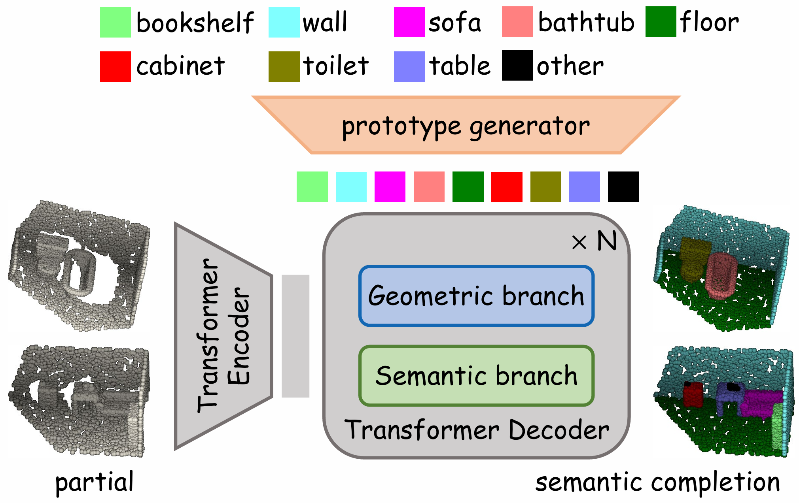

<div align="center">
  
# [Point Cloud Semantic Scene Completion with <br> Prototype-Guided Transformer](https://ojs.aaai.org/index.php/AAAI/article/view/37383)

<a href="https://pytorch.org/get-started/locally/"></a>
[](https://aaai.org/conference/aaai/aaai-26/)

</div>

<p align="center">
  
</p>

## 📚 Abstract
Semantic scene completion simultaneously reconstructs the shapes of missing regions and predicts semantic labels for the entire 3D scene. Although point cloud-based methods are more efficient than voxel-based methods, existing point cloud-based approaches largely fail to fully leverage semantic information. To address this challenge, we propose a Prototype-Guided Transformer (ProtoFormer) that encodes semantic information into a set of semantic prototypes to guide the underlying Transformer for semantic scene completion. Specifically, we leverage semantic prototypes to enhance information from both geometric and semantic perspectives, and integrate the top-K attention mechanisms to guide scene completion and semantic awareness. Extensive qualitative and quantitative experimental results demonstrate that ProtoFormer outperforms state-of-the-art approaches with low complexity.

## 🌱 Datasets
### SSC-PC & NYUCAD-PC
The SSC-PC and NYUCAD-PC dataset used in this work is sourced from the [CasFusionNet](https://github.com/JinfengX/CasFusionNet).
We adopt the same training and testing setup as in prior work, with several modifications. The structure of our data directory is as follows:

```bash
data
├── SSC-PC/
│   ├── 01_Bathroom_00_1_gt.npy
│   ├── 01_Bathroom_00_1_input.npy
│   ├── 01_Bathroom_00_2_gt.npy
│   ├── 01_Bathroom_00_2_input.npy
│   ├── ...
│   ├── 01_Bedroom_00_1_gt.npy
│   ├── 01_Bedroom_00_1_input.npy
│   ├── ...
├── NYUCAD-PC/
│   ├── 1_kitchen_0004_1_gt.npy
│   ├── 1_kitchen_0004_1_input.npy
│   ├── 2_kitchen_0004_2_gt.npy
│   ├── 2_kitchen_0004_2_input.npy
│   ├── 3_office_0003_1_gt.npy
│   ├── 3_office_0003_1_input.npy
│   ├── ...
```

## 🚀 Getting Started
### Requirements
- Ubuntu: 18.04 and above
- CUDA: 11.3 and above
- PyTorch: 1.10.1 and above

### Using CUDA extension
activate your environment and then
```
cd cuda/ChamferDistance
python setup.py install
```
and
```
cd cuda/pointnet2_ops_lib
python setup.py install
```

### Training
```
CUDA_VISIBLE_DEVICES=0 python train.py
```
### Evaluation
```
CUDA_VISIBLE_DEVICES=0 python test.py
```
### Pre-trained weights
- [SSC-PC](https://drive.google.com/file/d/1StgClDcE9VaymA9B6zkdNabtHj_NDzQu/view?usp=drive_link)

- [NYUCAD-PC](https://drive.google.com/file/d/1wJuXDbD81THfG2Cig9Ljd16SS_HXqlb8/view?usp=drive_link)

## ❤️ Acknowledgements
Some of the code of this repo is borrowed from:

- [SnowflakeNet](https://github.com/AllenXiangX/SnowflakeNet)

- [ChamferDistance](https://github.com/ThibaultGROUEIX/ChamferDistancePytorch)

- [PointNet++](https://github.com/erikwijmans/Pointnet2_PyTorch)

## 📄 Cite this work

```bibtex
@inproceedings{fang2026protoformer,
  title={Point Cloud Semantic Scene Completion with Prototype-Guided Transformer},
  author={Chenghao Fang and Jianqing Liang and Jiye Liang and Zijin Du and Feilong Cao},
  booktitle={Proceedings of the AAAI Conference on Artificial Intelligence (AAAI)},
  year={2026}
}
```

## 📌 License

This project is open sourced under MIT license.
